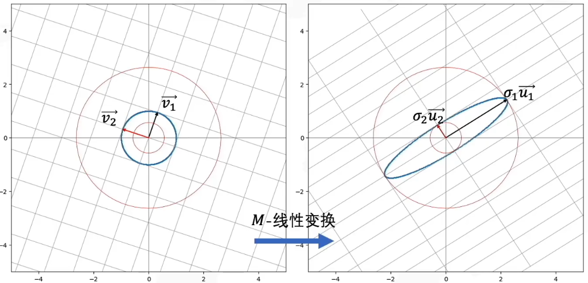

### SVD用于二维矩阵
$$M=U\Sigma V^T$$
物理意义：将线性变换阵$M$分解为旋转$U$、拉伸$\Sigma$和旋转$V^T$

我们想要在原始域中找到一个标准正交基$V$，$U$是$V$经过$M$变换后的标准正交基。

即
$$U\Sigma=MV$$
其中$V=[\vec{v_1}\ \vec{v_2}]$，$U=[\vec{u_1}\ \vec{u_2}]$为标准正交基，$\Sigma=\left[\begin{matrix}\sigma_1&0\\0&\sigma_2\end{matrix}\right]$是对基$U$进行拉伸的变化矩阵，$U\Sigma=[\sigma_1\vec{u_1}\ \ \sigma_2\vec{u_2}]$

### SVD推广到任意维度的矩阵
