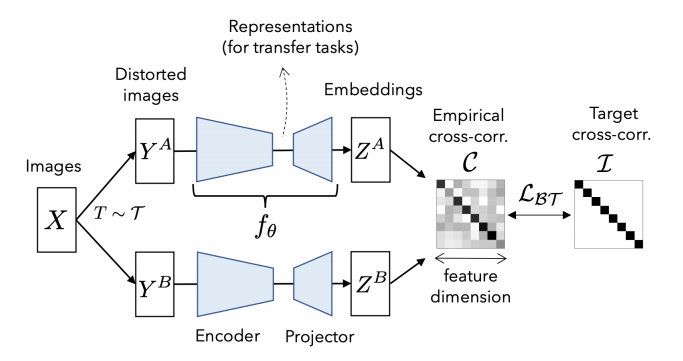
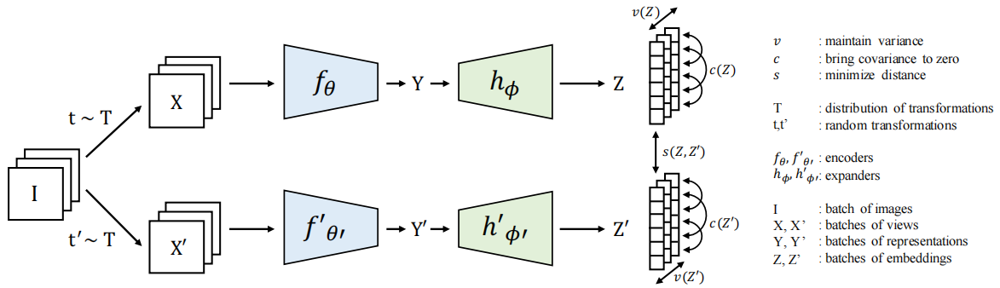

## Image

### Barlow Twins: Self-Supervised Learning via Redundancy Reduction
Jure Zbontar, Li Jing, Ishan Misra, Yann LeCun

- Making the __cross-correlation matrix__ between the output features of two identical networks as close to the identity matrix.
- Minimizing the __redundancy__ between the components of the output vectors.
- Does not require tricks used in recent CLR methods such as stopping gradient, momentem encoder or predictor network.

### VICReg: Variance-Invariance-Covariance Regularization for Self-Supervised Learning
Adrien Bardes, Jean Ponce, Yann LeCun
- Explicitly avoids the collapse problem in SSL methods with two regularizations term.
- __Invariance__: minimize distance between two views from one sample.
- __Variance__: maintain the distinct of each embedding in a batch.
- __Covariance__: decorrelating the variables between pairs of embedding variables.

### Understanding Dimensional Collapse in Contrastive Self-Supervised Learning
- Instead of complete collapse, contrastive methods still experience a __dimensional collapse__.

- Covariance matrix:
$$C=\frac{1}{N}\sum^N_{i=1}(\mathbf{z}_i-\bar{\mathbf{z}})(\mathbf{z}_i-\bar{\mathbf{z}})^T$$
where $\bar{\mathbf{z}}:=\sum^N_{i=1}\mathbf{z}_i/N$, $N$ is the total number of samples.

## Video
